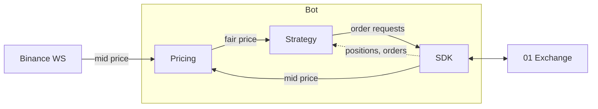

# 01 Market Maker

A simple market maker bot for [01 Exchange](https://01.xyz). Be the liquidity you wish to see in the market.

Thanks to [@c1ted](https://github.com/c1ted).


## Requirements

- **Node.js v25+** - Required for `Uint8Array.prototype.toHex()` ([TC39 proposal](https://github.com/tc39/proposal-arraybuffer-base64)) used by the SDK

## Disclaimer

**Use at your own risk.** The author is not responsible for any losses incurred when using this code.

This code is intended for educational purposes ONLY - do not use this code for real trades unless you fully understand what it does.

This is not a sophisticated market making program. It is intended to demonstrate how to connect to 01 Exchange using the SDK. Test with a fresh account.

**Note:** Only tested with BTC and ETH markets.

## Quick Start

```bash
# Install
npm i

# Setup
cp .env.example .env
# Edit .env and set PRIVATE_KEY

# Run BTC bot
npm run bot -- btc

# Run ETH bot
npm run bot -- eth

# Market monitor
npm run monitor -- btc
```

## Project Structure

```
src/
├── bots/mm/           # Market Maker bot
│   ├── index.ts       # MarketMaker class
│   ├── config.ts      # Configuration
│   ├── position.ts    # Position tracking
│   └── quoter.ts      # Quote generation
├── cli/               # Entry points
│   ├── bot.ts         # Bot CLI
│   └── monitor.ts     # Market monitor TUI
├── pricing/           # Price feeds (shared)
│   ├── binance.ts     # Binance WebSocket
│   └── fair-price.ts  # Fair price calculation
├── sdk/               # 01 Exchange SDK (shared)
│   ├── account.ts     # Account stream
│   ├── client.ts      # SDK client wrapper
│   ├── orderbook.ts   # Orderbook stream
│   └── orders.ts      # Order operations
├── utils/             # Utilities (shared)
│   └── logger.ts      # Logging
└── types.ts           # Shared types
```

## Architecture

Bot connects to 01 Exchange via official SDK ([@n1xyz/nord-ts](https://www.npmjs.com/package/@n1xyz/nord-ts)).



## How It Works

Buy low, sell high.

### Quoting

```
|------- 10bps -------|------- 10bps -------|
Buy Order          Fair Price          Sell Order
$99,900             $100,000             $100,100
```

- **Fair Price**: Based on Binance mid
- **Buy/Sell**: Fair ± spread
- Filled = bought low / sold high → profit

### Position Management

When position gets too big, switch to close mode:

- **Normal**: Quote both sides (10bps)
- **Close**: One side only, tighter spread (5bps)

## Configuration

Edit `src/bots/mm/config.ts`:

```typescript
export const DEFAULT_CONFIG = {
  spreadBps: 10, // Spread from fair price (10 bps = 0.1%)
  takeProfitBps: 5, // Spread in close mode
  orderSizeUsd: 100, // Order size in USD
  closeThresholdUsd: 10, // Trigger close mode when position >= this
  warmupSeconds: 10, // Seconds to warm up before quoting
  updateThrottleMs: 100, // Min interval between quote updates
  orderSyncIntervalMs: 3000, // Interval for syncing orders from API
  statusIntervalMs: 1000, // Interval for status display
  fairPriceWindowMs: 300000, // Window for fair price calculation (5 min)
  positionSyncIntervalMs: 5000, // Interval for position sync
}
```

```bash
npm run bot -- BTC
npm run bot -- ETH
```

## Commands

```bash
# Run market maker
npm run bot -- btc

# Market monitor
npm run monitor -- btc

# Build
npm run build
```

## Docker

```bash
# Setup
cp .env.example .env
# Edit .env and set PRIVATE_KEY

# Run with docker compose
docker compose up -d

# View logs
docker compose logs -f

# Stop
docker compose down

# Rebuild after code changes
docker compose up -d --build
```

Edit `docker-compose.yml` to change the symbol or add more bots:

```yaml
services:
  mm-btc:
    build: .
    command: ["BTC"]
    restart: unless-stopped
    env_file:
      - .env

  mm-eth:
    build: .
    command: ["ETH"]
    restart: unless-stopped
    env_file:
      - .env
```

## Environment Variables

| Variable      | Description                          | Required |
| ------------- | ------------------------------------ | -------- |
| `PRIVATE_KEY` | Base58 Solana private key            | Yes      |
| `RPC_URL`     | Solana RPC endpoint (for monitor)    | No       |
| `REFERENCE_FEED` | Sumber fair price: `binance` / `coinbase` / `zo` | No |
| `ENABLE_FEED_FAILOVER` | Auto fallback feed saat feed reference stale | No |
| `USE_BINANCE_FEED` | Legacy flag (`false` = `REFERENCE_FEED=zo`) | No |
| `REQUOTE_THRESHOLD_BPS` | Jangan replace order kalau beda harga masih <= ini | No |
| `MIN_ORDER_AGE_MS` | Umur minimum order sebelum boleh diganti | No |
| `LOG_LEVEL`   | Log level: debug, info, warn, error  | No       |

## Market Monitor

```bash
npm run monitor -- btc
```


## License

MIT
